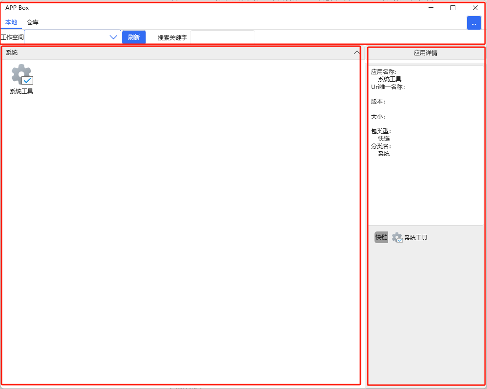

此开源项目致敬参考项目：[LauncherX - ClickPhase-https://clickphase.vercel.app/launcherx](https://clickphase.vercel.app/launcherx)

## 说明

AppBox是软件包生命周期管理工具，是用于团队或企业内部Windows桌面软件包下载部署、上传发布的工具。这个工具让机械式频繁检查软件版本、下载、部署、推送等操作一键操作化。

项目的终极远景是打造社区维护的企业桌面软件管理平台，让团队或者企业内部快速搭建开发测试生态系统。

### 功能和特点

1. 压缩打包上传功能：开发人员可以在需要打包时，通过命令行（如VS IDE调用外部工具）的方式将编译好的软件目录压缩打包传输到远程服务端。
2. 应用包发布：基于Dotnet6的WEB服务端，可以在Windows/Linux等环境运行，通过WEB发布多个版本不同应用程序列表，提供上传、下载、修改、删除等接口。
3. 应用包下载解压部署：客户端具有本地应用列表和远程应用仓库，可以查询远程应用仓库应用并一键下载解压部署到本地。
4. 仓库应用管理：客户端可以通过密码验证后调用远程服务端的上传、下载、修改应用信息、删除等接口。
5. 本地应用管理：客户端本地的应用可以启动、增加、删除、修改信息，可以把客户端常驻桌面任务栏，在需要打开应用时打开客户端，这样应用列表会比Windows默认桌面的应用快捷方式和文件混杂在一起更有条理；您还可以把应用快捷方式、软件包拖入该客户端，客户端会迁移这些应用入口到应用列表里面。
6. 让软件的开发到使用在一个软件工具中完成：从开发人员打包、测试人员下载测试、修改BUG备注、开发人员提供下一迭代软件包、目标用户下载软件使用，这个工具都提供了支持，让传统繁杂包管理流程被简化。软件虽小只有不到3MB，但功能丰富。

### 编译

需要Dotnet6 WindowsDesktop环境，VS2022编译AppBox项目、AppBoxInit项目。

### 使用

启动AppBoxInit.exe或者AppBox.exe

#### 子项目介绍

AppBox：桌面主软件。

AppBoxCore：主软件包含这个子软件，这个软件可以跨操作系统、CPU架构，提供服务端发布功能。

AppBoxInit：引导启动软件，可以没有，但考虑到AppBox OTA升级自身的需求，这个软件用于搜索目录下所有AppBox.exe并提供一个列表窗口让用户选择启动哪个版本的AppBox，这样可以解决AppBox多版本共存和OTA升级的需求。

#### 主界面介绍



上方：本地、远程仓库切换；多个工作空间（即应用列表文件夹）切换；搜索当前工作空间应用关键字；设置入口。

下方左边：当前工作空间的多个分类的不同应用列表展示，可以单机选中应用、右键弹出应用菜单，拖入本机电脑的文件到该区域添加应用（支持快捷方式文件、带exe入口的应用压缩包文件、其他格式的单个文件）

下方右边：当前选中应用的应用详情和该应用在该工作空间具有哪些版本的列表

注意，本地和仓库的界面基本一致，区别在于应用的右键菜单功能数量不一样，仓库会屏蔽部分功能的操作（仓库默认操作密码为admin），仓库的应用打开即下载该应用到本地的当前工作空间内。默认常驻菜单栏不退出软件，右上角点击关闭按钮主界面会最小化到菜单栏，必须菜单栏应用右键关闭窗口才能完全退出软件。

#### 开启发布服务端

在exe所在目录下，有个ConfigAppBox.yml文件可以配置服务发布的WEB端口（ConfigAppServer.Port）和开启发布（ConfigAppServer.IsEnable为true）。
```yaml
ConfigAppServer:
  IsEnable: true
```
修改后启动AppBoxCore程序即可开启服务端。

#### 配置客户端远程路径

在客户端设置中，远程文本输入框输入远程WEB服务的路径，一行一个工作空间路径，一般格式为：http://域名或IP:端口/工作空间

## 路线
目前处于阶段1。

阶段2：修复界面交互BUG、优化交互、补充文档。

阶段3：实现Linux、OSX命令行版本。

阶段4：实现Linux、OSX桌面版本。

## 贡献
欢迎在 Gitee / GitHub 页面上提交错误报告、补丁、功能请求、拉取请求。

## License

This library is licensed under the Apache License 2.0. (See [choosealicense.com/licenses/apache-2.0](https://choosealicense.com/licenses/apache-2.0) for a brief summery)  
A copy of this license is included in the repository under LICENSE.